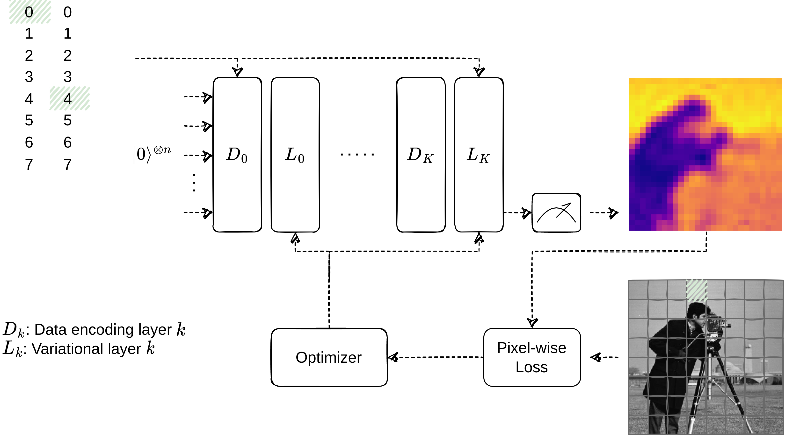

# Quantum Siren

Project aimed to investigate in the similarity between [1] and the inherent periodicity of parameterized gates within Variational Quantum Circuits.
The general idea is to build a network that learns an implicit representation of a function. This function, generally speaking, maps some input to an output and therefore can be almost anything from a speech signal to an image.
In case of the latter, the input would be the coordinate of a pixel and the output the pixel value itself.

## Approach :pencil:

The current ansatz is the (un-)famous ‘Circuit 19’ approach from [2].
Data is encoded across all Qubits (i.e. Qubit 0 ← X coordinate, Qubit 1 ← Y coordinate, Qubit 2 ← X coordinate, …) using RY gates and Data-Reuploading.
Initially I tried without data-reuploading but this resulted in a continuous color gradient across the whole image (barely any training effect):
- The main motivation for data-reuploading is, that, according to the paper, the number of encoding circuits determines the frequency in the function that the VQC can approximate
- Therefore my understanding is, that adding more layers should also increase the ‘sharpness’ of our image this correlates directly to the maximum (and number of) frequencies



## Getting Started :rocket:

This project is built using the [Kedro Framework](https://docs.kedro.org).

### Install Dependencies :floppy_disk:

**Using pip**:
```
pip install -r src/requirements-cpu.in
```
or 
```
pip install -r src/requirements-gpu.in
```
if you want to have the GPU package of PyTorch

**Using poetry**:
```
poetry install --extras='cpu'
```
or 
```
poetry install --extras='gpu'
```
if you want to have the GPU package of PyTorch

### Running Experiments :running:

Without further configuration you can execute
```
kedro run
```
which will load MNIST, preprocess the data and start training the model.

If want an overview of the nodes and pipelines, you can execute
```
kedro viz
```
which will open Kedro`s dashboard in you browser.


### Configuration :wrench:

The following parameters can be adjusted:
- Data Preprocessing Parameters: `conf/base/parameters/preprocessing.yml`
  - Image sidelength
- Training Parameters: `conf/base/parameters/data_science.yml`
  - Number of layers
  - Number of qubits
  - Number of steps
  - Shots (none/ number of shots)
  - Data reuploading
  - Learning rate
  - Type of ansatz for VQC and data encoding

## Literature :books:

[1]: [Implicit Neural Representations with Periodic Activation Functions](https://doi.org/10.48550/arXiv.2006.09661)
[2]: [Expressibility and entangling capability of parameterized quantum circuits for hybrid quantum-classical algorithms
](https://doi.org/10.1002/qute.201900070)